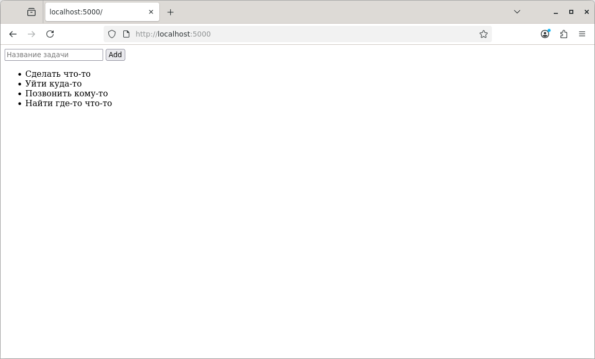

# Laboratory Work Docker

## Completed Tasks

- [x] Install Docker and Docker Compose
- [x] Create Dockerfile for Flask application
- [x] Run container with web application
- [x] Copy README.md to container
- [x] Create docker-compose.yml with MySQL
- [x] Run web application + database stack
- [x] Test application in browser

## Screenshot



## Quick Start

```bash
git clone https://github.com/USERNAME/lab_docker
cd lab_docker
docker compose up --build -d
Open in browser: http://localhost:5000

## Commands

```bash
docker compose up --build -d
docker compose down
docker compose logs -f
docker compose restart
docker compose ps
